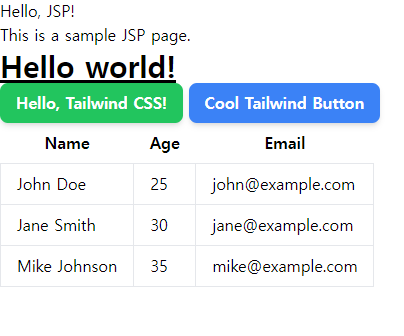

# Spring boot 3 + legacy JSP + tailwind css

<div>
    
</div>

## Spring Boot 3 프로젝트 생성

starter packages

```xml
<dependency>
	<groupId>org.projectlombok</groupId>
	<artifactId>lombok</artifactId>
	<optional>true</optional>
</dependency>
<dependency>
	<groupId>org.springframework.boot</groupId>
	<artifactId>spring-boot-starter-web</artifactId>
</dependency>
<dependency>
	<groupId>org.springframework.boot</groupId>
	<artifactId>spring-boot-devtools</artifactId>
	<scope>runtime</scope>
	<optional>true</optional>
</dependency>
```

## JSP세팅

1. pom.xml 설정

```xml
<dependency>
	<groupId>org.apache.tomcat.embed</groupId>
	<artifactId>tomcat-embed-jasper</artifactId>
</dependency>
<dependency>
	<groupId>javax.servlet</groupId>
	<artifactId>javax.servlet-api</artifactId>
	<version>4.0.1</version>
	<scope>provided</scope>
</dependency>
```

2. application.yml 설정

```yaml
spring:
    application:
        name: test
    mvc:
        view:
            prefix: /WEB-INF/jsp/
            suffix: .jsp
```

3. jsp 파일 작성.

디렉토리
```
src/main/webapp/WEB-INF/jsp/hello.jsp
```

```yaml
<%@ page language="java" contentType="text/html; charset=UTF-8"
pageEncoding="UTF-8" %>
<!DOCTYPE html>
<html>
<head>
<title>Hello JSP</title>
<link
rel="stylesheet"
href="${pageContext.request.contextPath}/css/output.css"
/>
</head>
<body>
<h1>Hello, JSP!</h1>
<p>This is a sample JSP page.</p>

<h1 class="text-3xl font-bold underline">Hello world!</h1>

<button
class="py-2 px-4 font-semibold rounded-lg shadow-md text-white bg-green-500 hover:bg-green-700"
>
Hello, Tailwind CSS!
</button>

<button
class="py-2 px-4 font-semibold rounded-lg shadow-md text-white bg-blue-500 hover:bg-blue-700"
>
Cool Tailwind Button
</button>
</body>
</html>
```

## tailwind 세팅

루트 디렉토리에서 명령어 실행

```bash
npm init -y
npm install -D tailwindcss postcss autoprefixer
npx tailwindcss init -p
npm i postcss-cli
```

생성된 tailwind.config.js 의 content부분을 수정

```jsx
/** @type {import('tailwindcss').Config} */
module.exports = {
    content: ["src/main/webapp/WEB-INF/jsp/**/*.jsp"],
    theme: {
        extend: {},
    },
    plugins: [],
};
```

tailwind.css 파일을 생성하고 내용 추가
```
@tailwind base;
@tailwind components;
@tailwind utilities;
```

package.json파일의 scripts부분에 명령어 추가

```jsx
{
...
 "scripts": {
        "build": "postcss ./tailwind.css -o target/classes/static/css/output.css",
        "watch": "postcss ./tailwind.css -o target/classes/static/css/output.css --watch"
  },
}
```

프로젝트 실행 이후 jsp는 target폴더 밑에 빌드된 파일들만 바라보니까 위처럼 target폴더 밑에 결과물을 생성하는 것이 적절함.

pom.xml에 build 태그 밑에 plugin을 추가. 이 plugin은 프로젝트 실행 또는 빌드할 때 실행되는 플러그인으로서 자동으로 tailwind를 빌드하고 target폴더에 결과물을 생성한다.

```xml
<plugin>
		<groupId>com.github.eirslett</groupId>
		<artifactId>frontend-maven-plugin</artifactId>
		<!-- Use the latest released version:
    		https://repo1.maven.org/maven2/com/github/eirslett/frontend-maven-plugin/ -->
		<version>1.9.1</version>

		<executions>

			<execution>
				<id>install node and npm</id>
				<goals>
					<goal>install-node-and-npm</goal>
				</goals>
				<configuration>
					<!-- See https://nodejs.org/en/download/ for latest node and npm (lts)
					versions -->
					<nodeVersion>v16.17.1</nodeVersion>
					<npmVersion>8.15.0</npmVersion>
				</configuration>
			</execution>

			<execution>
				<id>npm ci</id>
				<goals>
					<goal>npm</goal>
				</goals>
				<!-- Optional configuration which provides for running any npm command -->
				<configuration>
					<arguments>ci</arguments>
				</configuration>
			</execution>
			<execution>
				<id>npm run build</id>
				<goals>
					<goal>npm</goal>
				</goals>
				<configuration>
					<arguments>run build</arguments>
				</configuration>
			</execution>
		</executions>
	</plugin>
```

## 이후 작업 순서

프로젝트를 실행하고(vs code를 예로 들면 F5를 눌러 실행), terminal을 따로 띄워서 루트 디렉토리에서 npm run watch를 실행한다. 이후 jsp에 tailwind css 를 작성하고 저장하면 자동으로 tailwind가 빌드된다.

모든 작업자들은 위처럼 F5를 눌러 실행하고, 따로 터미널 띄워 npm run build 또는 npm run watch를 실행하고 작업을 시작한다.
